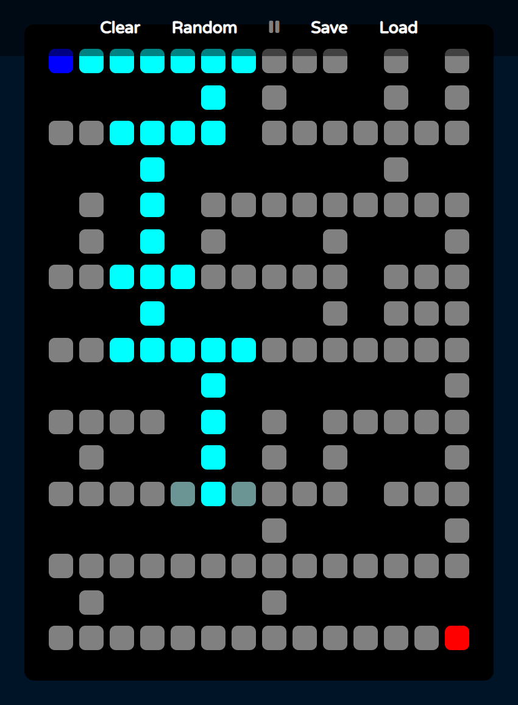

The project is currently hosted on github pages here:
https://sarath191181208.github.io/PathFindingViz/

# PathFindingViz

A simple simulation of DFS(Depth First Search)

## Demo

## Description

I am using **functional components & react hooks** to handle the events from the user.
List of Hooks used:

- useState.
- useCallback
- useRef

Learn About Hooks here:

- [React Docs](https://reactjs.org/docs/hooks-reference.html)
- [Ask your Friend Google😜](https://www.google.com/)

## Features

- Adding to the stack
- Popping from the stack

## Technologies

- [React](https://reactjs.org/)
- [Babel](https://babeljs.io/)

## Further Improvements
- [ ] Add more algorithms
- [ ] Adding a slider to adjust the speed of the algorithms.
- [ ] 
